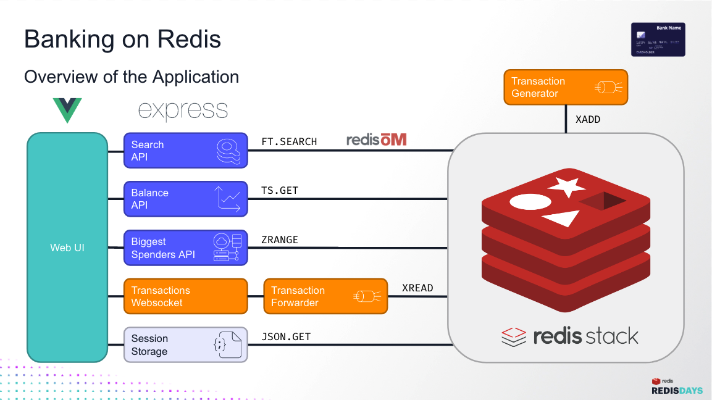

# Banking on Redis ##

We've explained a bit on how the application works and we even have a pretty diagram here for you to look at to help you understand it.



Next, we're gonna write some JavaSript code using what we've taught you. Then, we'll be done!

If you get stuck, there is a`solutions` folder you can look in but don't rush there. These challenges are aptly named and we've made them hard. If you get stuck or don't understand, don't hesitate to ask for assistance.

Now, on with the challenges!


## _Challenge 0_: Create a BankTransaction JSON Document ##

You'll want to store, or _save, the randomized bank transaction `bankTransaction` in the Redis OM `bankTransactionRepository`.

In `transactionGenerator.js`, replace this line with your work:

```javascript
const bankTransaction = transaction
```

## _Challenge 1_: Add Transactions to the Redis Stream ##

Using Node Redis, you'll want to add the randomly generated transaction object to the `transactions` stream. We want the stream to be automatically capped at approximately 100 entries, so make sure to include the `TRIM` object as an option within the stream add call.

Replace this line with your work:

```javascript
  const result = ''
```

If you get stuck, you might find it useful to know that options (such as TRIM) in Node Redis are added in an object as the last argument.


## _Challenge 2_: Add Redis to the `/transactions` Endpoint ##

You'll want to query Redis for all transactions using Redis OM and the `bankRepo`. Sort by `transactionDate` in descending order. Return only the first 10 entries.

Replace this line with your work:

```javascript
  const transactions = []
```


## _Challenge 3_: Read from the Stream of Transactions ##

Using Node Redis, you'll want to read the most recent entry in the Redis stream with the key `transactions`. Use the `$` symbol to retrieve the most recent entry within your stream read call. Parse through the results until you have a transaction object literal. You'll want to block for at least 10 seconds in order to capture the most recent entry. This call should be made with the second redis connection `redis2` to prevent locking out any other redis calls.

Replace this line with your work:

```javascript
    const result = [ { name: 'transactions', messages: [ {} ] } ]
```


## _Challenge 4_: Add Redis to the `/search` Endpoint ##

You'll want to search the `bankRepo` with a term matching `description`, matching `fromAccountName`, or equal to the `transactionType`. Note that `transactionType` is a different field type than `description` and `fromAccountName`, so it may need to use a different Redis OM search method. This search can chain all three field type methods into one big compounded search.

You might find the [Redis OM documentation](https://github.com/redis/redis-om-node) helpful here.

Replace this line with your work:

```javascript
    results = [{}]
```

And your all done! Congrats on completing the workshop. Go forth and use more Redis!
